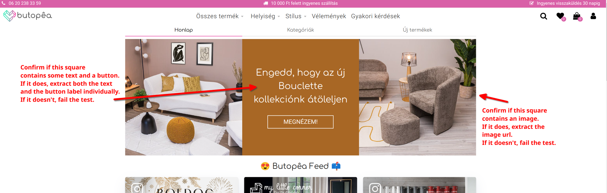
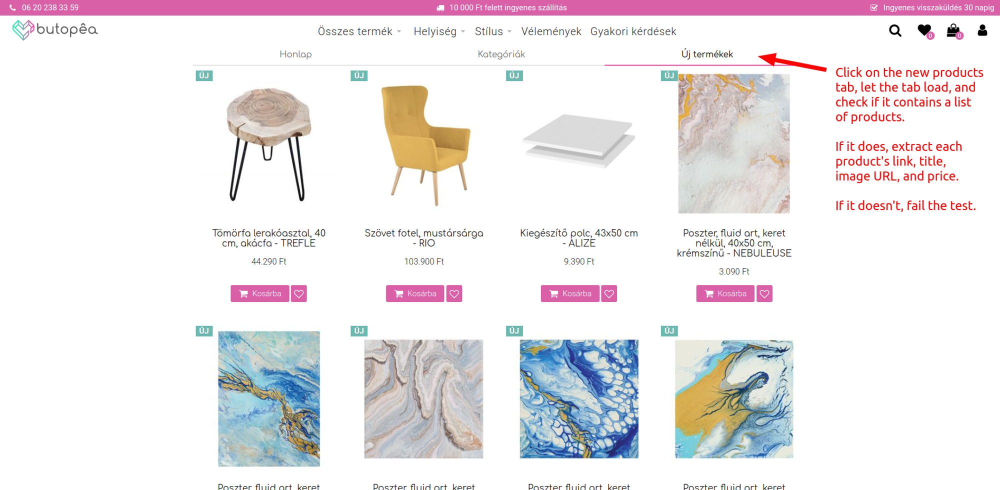
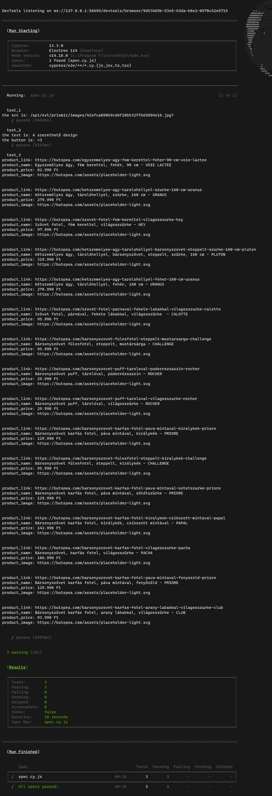
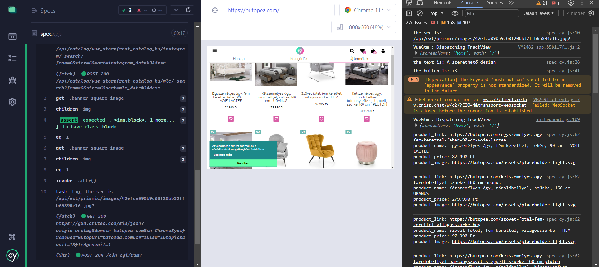
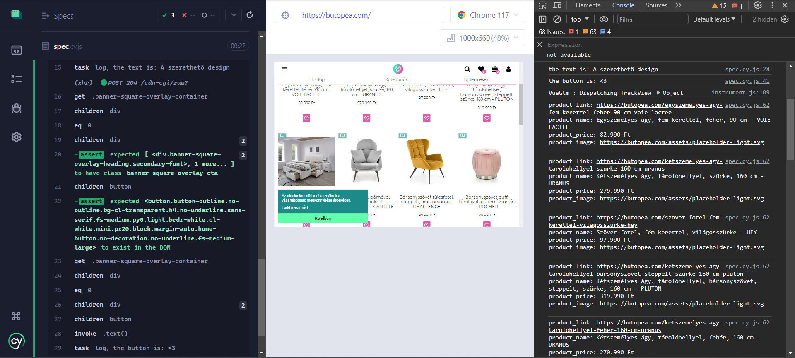

# Cypress End-to-End Testing
## Description
This project demonstrates how to use Cypress performing 3 tests.
## Requirements
- Ensure you have Node.js installed. If not, download it [here](https://nodejs.org/en/download/).

## Installation
- Clone the repository and navigate to the project directory.
```bash
git clone git@github.com:SamerMakni/end_to_end_testing.git
cd end_to_end_testing
```
- Install the dependencies.
```bash
npm install
```
## Usage
- You can run the tests in terminal by running the following command.
```bash
npx cypress run
```

- You can run the tests in the Cypress browser by running the following command
```bash
npx cypress open
```
A window will open displaying the Cypress interface, select `spec.cy.js` there.

## Explanation of code
- The tests are written in `cypress/e2e/spec.cy.js` directory.
- Ther are 3 tests in to test these 3 scenarios seen in the image below.




- All tests logs to the browser console, terminal, and to Cypress dashboard.
- We used `cy.task` to log to the terminal. `cypress.config.js` file is used to configure the task.

## Results
- Results running the tests in the terminal can be seen in the image below, or in the `terminal_output` file.



- Results running the tests in the browser:






